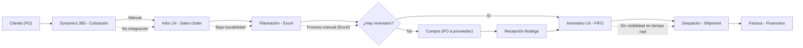
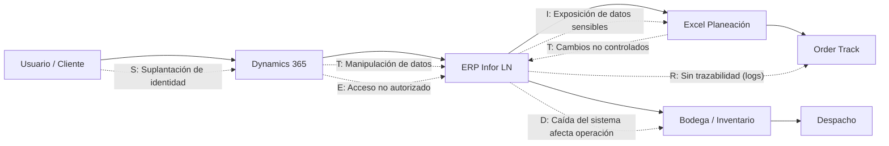

# Propuesta Técnica – Transformación Digital e Infraestructura de Seguridad
## Bray Controls Andina S.A.S.

*Proyecto 2 – Checklist de Cumplimiento Normativo | Arquitectura Empresarial*
*Julián Barragán · Josue Sarmiento · Juan González | Abril 2026*

---

## Resumen Ejecutivo

Bray Controls Andina opera hoy con un sistema de información fragmentado donde el ERP corporativo (Infor LN) coexiste con archivos Excel, correos electrónicos y conocimiento concentrado en personas. El resultado es una operación vulnerable: sin trazabilidad en tiempo real, con riesgos de fuga de información y fuera de cumplimiento con la Ley 1581 de 2012 e ISO/IEC 27001.

**La propuesta central es:** centralizar y automatizar la gestión de órdenes e inventario para eliminar la dependencia de Excel y lograr trazabilidad en tiempo real, integrando los sistemas existentes (LN, Dynamics 365, Order Track) sobre una base de seguridad formal y cumplimiento normativo.

Con esto se espera reducir los errores de despacho, eliminar los tiempos muertos de búsqueda de información, disminuir pérdidas por stockouts y SMI, y proteger los activos de información estratégicos de la empresa.

---

## 1. Descripción de la Empresa

**Bray Controls Andina** es una subsidiaria colombiana de Bray International, empresa multinacional privada de origen estadounidense especializada en la fabricación y distribución de válvulas industriales, actuadores y accesorios de control de flujo. Bray Controls Andina actúa como representante y distribuidor autorizado de Bray en Colombia y varios territorios de Latinoamérica: Ecuador, Venezuela (gestionada desde Colombia), Perú, Argentina, Brasil, Chile, México y Centroamérica.

La empresa opera con tres bodegas físicas en Bogotá, Cali y Barranquilla, y su estructura organizacional se divide en cuatro áreas: gerencia general, operaciones, financiero y comercial.

---

## 2. Contexto del Sistema Actual

### 2.1 Flujo Operativo Principal

```
Cliente → Cotización (Dynamics 365) → Orden de Compra → Sales Order (LN) →
Planeación (Excel) → Compras/PO (LN) → Recepción → Inventario → Despacho → Facturación
```

**Comercial (Ventas externas e internas):**
Los vendedores externos visitan clientes y levantan necesidades técnicas. Las ventas internas gestionan cotizaciones en **Dynamics 365**, determinan precios, ubican disponibilidad en subsidiarias y validan opciones técnicas. Una vez el cliente confirma la orden de compra, ventas internas la ingresa al ERP **Infor LN** generando la Sales Order (SO) oficial. No existe integración automática entre Dynamics 365 y LN: la información se retranscribe manualmente.

**Operaciones:**
Recibe la SO y determina la ruta operativa: despacho desde bodega propia (**Warehouse**) o gestión como **Direct Delivery** (material facturado por Bray Andina pero despachado desde otra subsidiaria, típicamente Bray Houston, al cliente final). En ambos casos el seguimiento se realiza con una combinación de LN, Order Track y llamadas internas.

**Compras e importaciones:**
Las órdenes de compra internacionales (Bray Houston, Bray China) tienen lead times de 8 a 22 semanas estándar, y hasta 7 meses para válvulas especiales de gran tamaño. La gestión implica negociación bajo incoterms, proceso de nacionalización ante la DIAN y seguimiento logístico manual por parte del área de operaciones.

**Inventario y bodega:**
Metodología **FIFO** (primero en entrar, primero en salir). El ERP LN gestiona ubicaciones de caja, picking y movimientos al área de shipping. Se realizan **3 conteos cíclicos (cycle counting) al año** con meta del 75% del valor de inventario al cierre del tercer trimestre. El coordinador de bodega gestiona el ciclo físico apoyado en el ERP.

### 2.2 Sistemas Tecnológicos en Uso

| Sistema | Propósito | Alcance real |
|--------|-----------|-------------|
| Infor LN (ERP) | SO, PO, inventario, despacho, facturación | Core transaccional |
| Dynamics 365 | Cotizaciones y CRM | Solo área comercial |
| Order Track | Seguimiento de estados intermedios de órdenes | En proceso de implementación — aún no operativo |
| Excel | Planeación, pronóstico, seguimiento paralelo | Uso masivo en operaciones |
| Power BI | Reportes y dashboards | Uso parcial, sin integración formal al ERP |
| Correo electrónico | Comunicación con proveedores y entre áreas | Uso transversal sin trazabilidad |

---

## 3. Diagnóstico – Arquitectura AS-IS

### 3.1 Descripción General

La arquitectura actual es un sistema **híbrido no integrado**: el ERP LN centraliza los registros transaccionales pero múltiples herramientas externas operan en paralelo sin sincronización automática. El conocimiento operativo crítico vive en las personas, no en los sistemas.

> **[DIAGRAMA AS-IS]**



### 3.2 Debilidades y Cuellos de Botella

**3.2.1 Fragmentación de sistemas**
El ERP LN no cubre la complejidad operativa real de Bray Andina. El corporativo tuvo que crear **Order Track** como complemento porque LN solo permite dos estados intermedios (recibido → shipping), sin visibilidad de ensamble, subcontratista, inspección ni otras etapas del proceso. El resultado es que la operación salta constantemente entre LN, Order Track, Excel y llamadas telefónicas, sin que ningún sistema tenga la imagen completa.

**3.2.2 Excesiva dependencia de Excel**
Excel opera como repositorio primario para pronóstico de demanda, seguimiento de compras internacionales y planeación de entregas. Esto genera doble digitalización (del ERP a Excel), alto riesgo de errores humanos, nula trazabilidad de cambios y ausencia total de control de acceso sobre información sensible como márgenes y costos de productos.

**3.2.3 Planeación manual e imprecisa**
El Plan Delivery Date lo calcula un único planeador de forma manual, revisando línea por línea en el ERP y cruzando con inventario disponible y tiempos de compras internacionales. No existen alertas automáticas ni motor de cálculo: una sola persona concentra todo el conocimiento de programación de entregas, lo que representa además un riesgo de continuidad operacional.

**3.2.4 Gestión de inventario con SMI y stockouts simultáneos**
La empresa enfrenta ambos problemas a la vez: **Slow Moving Inventory (SMI)** en ítems que no rotan como se proyectó, y **stockouts** en ítems de alta demanda. Los tiempos de reposición de 4 a 5 meses hacen imposible reaccionar con rapidez. Los Reorder Points no se revisan de forma automatizada, generando decisiones reactivas en lugar de preventivas.

**3.2.5 Comunicación interdepartamental sin canal unificado**
No existe un sistema que integre las comunicaciones operativas entre ventas, operaciones y financiero. Reasignaciones de inventario, cambios en órdenes y actualizaciones de estado viajan por teléfono o correo electrónico, sin registro formal, sin trazabilidad y con alto riesgo de pérdida de información entre áreas.

**3.2.6 Ausencia de trazabilidad en tiempo real**
La empresa no puede responder en tiempo real a "¿en qué estado está esta orden?" sin llamar directamente a la persona responsable. El conocimiento operativo está centralizado en individuos, no en sistemas, lo que genera vulnerabilidad operacional ante ausencias o rotación de personal.

---

## 4. Análisis de Seguridad – Modelo STRIDE

El modelo STRIDE clasifica las amenazas de seguridad en seis categorías: **S**poofing (suplantación), **T**ampering (manipulación), **R**epudiation (negación), **I**nformation Disclosure (exposición), **D**enial of Service (interrupción) y **E**levation of Privilege (escalamiento). Se aplicó sobre los componentes tecnológicos críticos del sistema de Bray Controls Andina.

> **[DIAGRAMA STRIDE]**


| ID | Componente | Activo Afectado | Tipo STRIDE | Descripción de la Amenaza | Impacto | Probabilidad | Nivel de Riesgo | Mitigación Recomendada |
|----|-----------|----------------|------------|--------------------------|---------|-------------|----------------|----------------------|
| T1 | ERP LN / Dynamics 365 | Credenciales de usuarios | Spoofing | Acceso no autorizado por robo de credenciales vía phishing o reutilización de contraseñas | Acceso a órdenes, precios y datos de clientes | Media | Alto | MFA, política de contraseñas fuertes, monitoreo de intentos de login |
| T2 | Excel y herramientas paralelas | Integridad de datos operativos | Tampering | Modificación no controlada de fechas, precios o cantidades de inventario en archivos Excel sin restricción de acceso | Errores en despacho y decisiones financieras incorrectas | Alta | Alto | Centralizar datos en ERP, eliminar Excel como repositorio primario de operación |
| T3 | Order Track / ERP LN | Historial de acciones | Repudiation | Ausencia de logs completos sobre cambios realizados en órdenes o inventario | Imposibilidad de auditar responsabilidades ante errores o fraudes | Media | Medio | Auditoría centralizada con logs inmutables que registren usuario, hora y acción |
| T4 | ERP LN y archivos Excel | Información comercial y de costos | Information Disclosure | Fuga de precios, márgenes y datos de clientes por acceso no controlado a archivos compartidos o sin cifrar | Daño competitivo y riesgo legal | Media | Alto | RBAC, cifrado de archivos con información sensible, restricción de compartición externa |
| T5 | ERP LN | Disponibilidad del servicio | Denial of Service | Caída del ERP detiene el procesamiento de SO, PO, inventario y despacho en las tres sedes simultáneamente | Parálisis operativa total de la empresa | Baja | Alto | Plan de contingencia documentado, backups automáticos diarios, redundancia del sistema |
| T6 | Gestión de usuarios ERP | Permisos y roles | Elevation of Privilege | Usuario con acceso básico obtiene funciones de administración por ausencia de RBAC estricto o revisión de permisos | Modificación no autorizada de órdenes, precios o inventario | Baja | Alto | RBAC estricto, revisiones periódicas de permisos, principio de mínimo privilegio |
| T7 | Correo electrónico | Órdenes de compra internacionales | Tampering / Spoofing | Manipulación o suplantación de correos que contienen POs enviadas a proveedores internacionales (Bray Houston, Bray China) | Compras fraudulentas o con información incorrecta que afectan el inventario y la operación | Baja | Alto | Firmas digitales en correos, validación de proveedores, canal de confirmación alternativo para POs grandes |
| T8 | Excel de planeación | Datos de pronóstico y Reorder Points | Information Disclosure | Exposición de estrategia de inventario, rotación y márgenes en archivos sin control de acceso ni clasificación | Pérdida de ventaja competitiva frente a distribuidores competidores | Alta | Alto | Migrar a sistema centralizado con control de acceso por rol y clasificación de datos |

---

## 5. Checklist de Cumplimiento Normativo

### 5.1 Resultado del Checklist

> **[DIAGRAMA / VISUALIZACIÓN DEL CHECKLIST]**
> *La representación visual de los resultados del checklist será insertada aquí.*

| N° | Categoría | Criterio de Cumplimiento | Nivel | Evidencia / Justificación | Recomendación |
|----|----------|--------------------------|-------|--------------------------|--------------|
| 1 | Datos Personales | Existe política de tratamiento de datos personales | ❌ | No se evidenció política formal durante el levantamiento | Definir política de tratamiento de datos |
| 2 | Datos Personales | Se solicita consentimiento para uso de datos | ❌ | Sin mecanismos explícitos en procesos comerciales | Implementar consentimiento informado en procesos de venta |
| 3 | Datos Personales | Control de acceso a datos personales | ⚠️ | ERP LN tiene control básico; Excel y correo no | Centralizar accesos, eliminar uso de archivos externos para datos personales |
| 4 | Datos Personales | Clasificación de datos | ❌ | No se evidenció esquema de clasificación formal | Definir niveles: público, interno, confidencial, restringido |
| 5 | Seguridad | Control de acceso basado en roles (RBAC) | ⚠️ | Existe en ERP pero no en herramientas paralelas (Excel, correo) | Implementar RBAC unificado en todos los sistemas |
| 6 | Seguridad | Autenticación segura (MFA) | ❌ | No se evidenció MFA en ningún sistema | Implementar autenticación multifactor en ERP y Dynamics 365 |
| 7 | Seguridad | Gestión de usuarios (altas/bajas) | ⚠️ | No hay procedimiento formal documentado | Definir proceso formal de gestión de usuarios con aprobación |
| 8 | Seguridad | Registro de logs y auditoría | ❌ | No hay trazabilidad completa fuera del ERP | Implementar auditoría centralizada con logs inmutables |
| 9 | Seguridad | Protección contra accesos no autorizados | ⚠️ | Alta dependencia del ERP; exposición en Excel y correo | Reducir uso de herramientas externas sin control de acceso |
| 10 | Información | Integridad de datos | ❌ | Procesos manuales y uso de Excel como repositorio primario | Automatizar validación y centralizar datos en el ERP |
| 11 | Información | Disponibilidad del sistema | ⚠️ | Alta dependencia del ERP sin plan de contingencia documentado | Implementar plan de continuidad y recuperación ante desastres |
| 12 | Información | Protección de información sensible | ⚠️ | Datos sensibles dispersos en múltiples herramientas sin control | Centralizar almacenamiento y aplicar cifrado donde corresponda |
| 13 | Operación | Trazabilidad de procesos | ❌ | Seguimiento manual mediante llamadas y Excel; Order Track aún no operativo | Activar Order Track y establecer trazabilidad formal de estados |
| 14 | Operación | Gestión de inventario confiable | ⚠️ | Problemas simultáneos de SMI y stockouts sin automatización | Mejorar integración inventario-compras con alertas de reorden |
| 15 | Operación | Automatización de procesos | ❌ | Alta dependencia de procesos manuales en planeación y despacho | Automatizar el flujo operativo desde la SO hasta el despacho |
| 16 | Cumplimiento | Alineación con Ley 1581 de 2012 | ⚠️ | Controles básicos presentes pero incompletos | Alinear procesos con la normativa colombiana de datos personales |
| 17 | Cumplimiento | Sistema de Gestión de Seguridad (SGSI) | ⚠️ | No existe SGSI formal implementado | Implementar SGSI alineado a ISO/IEC 27001 |
| 18 | Cumplimiento | Gestión de riesgos de seguridad | ❌ | No se evidenció proceso formal de análisis de riesgos | Implementar metodología de gestión de riesgos (ej. NIST SP 800-30) |
| 19 | Cumplimiento | Plan de respuesta a incidentes | ❌ | No hay procedimiento definido ante incidentes de seguridad | Definir plan de respuesta con roles, tiempos y canales de escalamiento |
| 20 | Cumplimiento | Protección contra fuga de información (DLP) | ⚠️ | Uso de Excel y correo sin controles aumenta el riesgo de fuga | Implementar controles DLP en herramientas corporativas |

### 5.2 Resumen de Cumplimiento

| Estado | Cantidad | Porcentaje |
|--------|---------|-----------|
| ✅ Cumple completamente | 0 | 0% |
| ⚠️ Cumplimiento parcial | 10 | 50% |
| ❌ No cumple | 10 | 50% |

El sistema no cumple con ningún criterio de forma completa. Los 10 criterios en estado parcial dependen casi exclusivamente de los controles básicos del ERP LN, los cuales no se extienden a las herramientas paralelas (Excel, correo, Dynamics 365) donde ocurre una parte significativa de la operación real.

---

## 6. Matriz de Brechas Identificadas

| Categoría | Brecha | Riesgo Principal | Recomendación | Prioridad |
|----------|--------|-----------------|---------------|----------|
| Datos Personales | Sin política de tratamiento de datos | Sanciones económicas por incumplimiento de Ley 1581 | Definir y publicar política formal de datos personales | Alta |
| Datos Personales | Sin consentimiento informado | Uso indebido de datos personales de clientes | Implementar mecanismos de consentimiento en procesos de venta | Alta |
| Seguridad | Sin MFA en ningún sistema | Accesos no autorizados a ERP y Dynamics 365 | Implementar autenticación multifactor en todos los sistemas | Alta |
| Seguridad | Sin logs ni auditoría centralizada | Sin trazabilidad ante errores, fraudes o incidentes | Sistema de auditoría con logs inmutables por acción y usuario | Alta |
| Información | Excel como repositorio primario de operación | Fuga, pérdida o alteración no detectada de datos críticos | Centralizar en ERP y eliminar Excel como fuente de datos operativa | Alta |
| Operación | Sin trazabilidad de órdenes en tiempo real | Errores en despacho, retrasos y pérdida de visibilidad entre áreas | Activar y adoptar formalmente Order Track en todas las áreas | Alta |
| Operación | Planeación y cálculo de fechas totalmente manuales | Errores humanos, retrasos operativos y dependencia de una persona | Automatizar el Plan Delivery Date con motor integrado al ERP | Alta |
| Operación | Reorder Points sin revisión automatizada | SMI acumulado y stockouts simultáneos sin anticipación | Motor de revisión automática de puntos de reorden con alertas | Alta |
| Operación | Comunicación sin canal unificado por orden | Pérdida de información y decisiones no registradas entre áreas | Integrar comunicación operativa ligada a cada SO en el sistema | Alta |
| Cumplimiento | Sin SGSI formal | Riesgos de seguridad no identificados ni gestionados | Implementar SGSI alineado a ISO/IEC 27001 | Media |
| Cumplimiento | Sin metodología de gestión de riesgos | Vulnerabilidades no identificadas ni priorizadas | Adoptar metodología formal de análisis de riesgos | Alta |
| Información | Sin plan de continuidad del negocio | Interrupción total de la operación ante caída del ERP | Plan de contingencia documentado y probado con roles definidos | Media |
| Seguridad | RBAC inconsistente entre sistemas | Acceso indebido a información sensible de costos y clientes | Unificar control de acceso en todos los sistemas corporativos | Alta |
| Información | Sin clasificación formal de datos | Manejo inadecuado de información sensible y confidencial | Definir esquema: público / interno / confidencial / restringido | Media |

---

## 7. Arquitectura Propuesta (TO-BE)

### 7.1 Idea Central

> Centralizar y automatizar la gestión de órdenes e inventario de Bray Controls Andina, eliminando la dependencia de Excel mediante la integración de los sistemas existentes (LN, Dynamics 365, Order Track, Power BI), sobre una base formal de seguridad y cumplimiento normativo, logrando trazabilidad en tiempo real para todas las áreas de la organización.

### 7.2 Diagrama TO-BE

> **[DIAGRAMA DE ARQUITECTURA TO-BE]**
> *El diagrama de la arquitectura propuesta será insertado aquí.*

### 7.3 Componentes por Capa

**Capa de Presentación (Interfaz interna por roles)**

Portal interno corporativo con acceso diferenciado por rol: comercial, operaciones, bodega, financiero y gerencia. No se trata de un sitio público sino de un dashboard interno unificado que centraliza la visibilidad de todas las áreas. Incluye estado en tiempo real de SO, PO, inventario y despachos; módulo de alertas automáticas para fechas críticas, reorder points y stockouts; y acceso móvil para vendedores externos en campo. La capa de visualización estaría soportada por **Power BI** conectado formalmente al ERP, reemplazando los reportes manuales actualmente elaborados en Excel.

**Capa de Aplicaciones e Integración**

- **Infor LN** como único sistema transaccional de registro: SO, PO, inventario, despacho y facturación. Ningún dato operativo crítico existe únicamente fuera del ERP.
- **API REST** entre Dynamics 365 y LN para eliminar la retranscripción manual al pasar de cotización a SO. La integración sincronizaría número de parte, cantidad, precio y datos del cliente directamente entre los dos sistemas, reduciendo errores de digitación.
- **Order Track** integrado formalmente como módulo de seguimiento de estados intermedios: entrada a bodega, ensamble, subcontratista, inspección, shipping y despacho final. Visible en tiempo real para todas las áreas sin necesidad de llamar a nadie.
- **Motor de planeación de demanda** integrado al LN: cálculo automático del Plan Delivery Date considerando inventario disponible, POs en tránsito y lead times históricos de cada proveedor. Alertas automáticas cuando una fecha de entrega comprometida con el cliente está en riesgo.
- **Módulo de Reorder Points automático**: revisión periódica programada que compara niveles de inventario con umbrales configurados y genera alertas al planeador o propuestas de PO automáticas, anticipando tanto stockouts como acumulación de SMI.

**Capa de Datos**

- **Base de datos central SQL** (desplegable en la nube o servidor dedicado según directrices del corporativo): repositorio único de verdad para órdenes, inventario, clientes y proveedores. Excel puede seguir siendo usado para análisis puntuales pero no como fuente de datos operativa primaria.
- **Clasificación de datos** en cuatro niveles: público, interno, confidencial y restringido.
- Backups automáticos diarios con política de retención mínima de 90 días.
- **Logs de auditoría inmutables** sobre todas las acciones críticas: creación y modificación de SO/PO, movimientos de inventario, cambios de configuración y gestión de usuarios.

**Capa de Seguridad**

- **MFA (autenticación multifactor)** obligatorio en todos los sistemas: ERP LN, Dynamics 365, Order Track y portal interno.
- **RBAC (control de acceso basado en roles)**: cinco roles base definidos — comercial, operaciones, bodega, financiero y gerencia — cada uno con permisos mínimos necesarios para su función (principio de mínimo privilegio).
- Proceso formal de gestión de usuarios: protocolo documentado de altas, bajas y cambios de rol con aprobación y registro.
- **SIEM básico**: monitoreo de eventos de seguridad y alertas automáticas ante accesos sospechosos, intentos fallidos o accesos fuera de horario laboral.
- **Controles DLP** (Data Loss Prevention): políticas que prevengan la extracción no autorizada de información sensible como precios, márgenes y datos de clientes.

**Capa de Cumplimiento**

- Política formal de tratamiento de datos personales alineada con **Ley 1581 de 2012 (Habeas Data)**.
- Mecanismos de consentimiento informado implementados en los procesos comerciales con clientes y prospectos.
- **SGSI** alineado con **ISO/IEC 27001**: análisis formal de riesgos, gestión de activos de información, controles documentados y ciclo de mejora continua.
- Plan de continuidad del negocio (BCP) y plan de recuperación ante desastres (DRP) con roles, tiempos de recuperación (RTO/RPO) y procedimientos probados.
- Plan de respuesta a incidentes de seguridad con roles definidos, escalamiento y tiempos de respuesta establecidos.

### 7.4 Impacto Esperado en el Negocio

| Indicador | Situación Actual | Con la Propuesta TO-BE |
|----------|-----------------|----------------------|
| Trazabilidad de órdenes | Solo disponible llamando a la persona responsable | ↑ En tiempo real para todas las áreas desde cualquier dispositivo |
| Errores en despacho | Frecuentes por información manual y desactualizada | ↓ Reducción significativa al automatizar estados y alertas |
| Tiempo de respuesta al cliente | Lento: depende de disponibilidad de personas | ↓ Reducción al tener información centralizada y actualizada |
| Pérdidas por stockouts | Ocurren sin anticipación, difíciles de reaccionar | ↓ Anticipadas por alertas automáticas de reorden |
| Capital inmovilizado en SMI | Sin control proactivo ni alertas tempranas | ↓ Mayor visibilidad y control preventivo de rotación |
| Cumplimiento normativo | 0% de criterios completamente cumplidos | ↑ Cumplimiento progresivo con Ley 1581 e ISO/IEC 27001 |
| Riesgo de fuga de información | Alto: Excel sin control de acceso ni cifrado | ↓ Reducido por RBAC, MFA, DLP y base de datos centralizada |
| Satisfacción del cliente | Afectada por retrasos, errores y falta de visibilidad | ↑ Mejorada por mayor precisión en fechas y visibilidad de estado |
| Dependencia de personas clave | Alta: conocimiento en individuos, no en sistemas | ↓ Reducida al documentar procesos y centralizar información |

---

## 8. Normativas Analizadas

> **[DIAGRAMA DE BRECHAS NORMATIVAS]**
> *El diagrama comparativo de cumplimiento normativo será insertado aquí.*

| Normativa | Descripción | Cumplimiento Actual | Acciones Requeridas |
|----------|------------|--------------------|--------------------|
| Ley 1581 de 2012 – Habeas Data (Colombia) | Regula el tratamiento de datos personales de clientes, proveedores y empleados | Bajo: sin política formal, sin consentimiento explícito, sin clasificación de datos | Política de protección de datos, consentimiento informado, clasificación de activos de información |
| ISO/IEC 27001:2022 | Marco internacional para el Sistema de Gestión de Seguridad de la Información (SGSI) | Parcial: controles básicos en ERP LN pero sin SGSI formal, sin gestión de riesgos documentada ni plan de continuidad | Implementar SGSI, análisis de riesgos formal, auditoría centralizada, plan de continuidad del negocio |
| Gobernanza de datos (buenas prácticas) | Principios de calidad, disponibilidad, integridad y trazabilidad de la información | Bajo: datos fragmentados entre sistemas sin gobierno formal, sin data owner ni data steward definidos | Definir roles de dato (data owner y data steward), esquema de clasificación, políticas internas de uso |

---

## 9. Investigación Complementaria

### Tema: ISO/IEC 27001 y Gestión de Seguridad de la Información

ISO/IEC 27001 es el estándar internacional que define los requisitos para establecer, implementar, mantener y mejorar de forma continua un **Sistema de Gestión de Seguridad de la Información (SGSI)**. Su propósito central es proteger la **confidencialidad, integridad y disponibilidad** de la información mediante controles de naturaleza organizacional, técnica y física.

El estándar adopta un enfoque basado en riesgos: las organizaciones deben identificar sus activos de información, evaluar las amenazas y vulnerabilidades que los afectan, calcular el impacto potencial de cada riesgo y definir controles proporcionales para mitigarlos. Entre los controles más relevantes para el contexto de Bray Controls Andina se encuentran: gestión de control de acceso (RBAC, MFA), gestión de incidentes de seguridad, trazabilidad mediante auditoría de logs, protección de datos en tránsito y en reposo, y planes de continuidad del negocio.

En el análisis realizado se evidenció que Bray Controls Andina no cuenta con un SGSI formal. Esta ausencia genera riesgos concretos ya identificados: falta de trazabilidad en acciones críticas, exposición de información sensible a través de Excel y correo electrónico, ausencia de procedimientos ante incidentes y dependencia total en el conocimiento de personas específicas. La implementación de ISO/IEC 27001 permitiría estructurar la seguridad de la información de manera formal, reducir riesgos operacionales y de cumplimiento, y sentar las bases para una operación más confiable y escalable.

---

## 10. Recomendaciones por Horizonte de Tiempo

### Corto Plazo — 0 a 3 meses (Acciones críticas de bajo costo)

1. **Implementar MFA** en ERP LN y Dynamics 365 como medida de seguridad inmediata.
2. **Formalizar el proceso de gestión de usuarios**: protocolo documentado de altas, bajas y cambios de rol con aprobación registrada.
3. **Activar Order Track** como herramienta oficial de seguimiento de estados de órdenes y capacitar al equipo operativo en su uso.
4. **Implementar logs de auditoría** sobre acciones clave en el ERP: creación y modificación de SO, PO y movimientos de inventario.
5. **Definir y publicar la política de tratamiento de datos personales** conforme a la Ley 1581 de 2012.
6. **Establecer regla operativa inmediata**: ningún dato operativo crítico puede existir únicamente en Excel — todo debe quedar registrado en el ERP.

### Mediano Plazo — 3 a 6 meses (Integración y automatización)

7. **Desarrollar la API REST** entre Dynamics 365 y LN para eliminar la retranscripción manual al pasar de cotización a SO.
8. **Automatizar la revisión de Reorder Points** con alertas automáticas al planeador cuando un ítem caiga por debajo del umbral definido.
9. **Implementar RBAC unificado** que cubra ERP LN, Order Track y todas las herramientas con acceso a datos operativos.
10. **Formalizar Power BI** como capa oficial de dashboards conectada al ERP, reemplazando progresivamente los reportes en Excel.
11. **Iniciar la implementación del SGSI** con inventario de activos de información, análisis de riesgos formal y clasificación de datos.

### Largo Plazo — 6 a 12 meses (Madurez operativa y normativa)

12. **Desarrollar o integrar un módulo de planeación de demanda** al ERP para calcular automáticamente el Plan Delivery Date considerando inventario disponible, POs en tránsito y lead times históricos.
13. **Formalizar el Plan de Continuidad del Negocio (BCP)** y el Plan de Respuesta a Incidentes, con roles, tiempos de recuperación (RTO/RPO) y simulacros periódicos.
14. **Definir roles de data owner y data steward** para cada dominio de información: operaciones, comercial y financiero.
15. **Capacitar formalmente a todo el equipo** en seguridad de la información, uso adecuado de herramientas corporativas y normativa colombiana aplicable.
16. **Evaluar la modernización del ERP LN** en coordinación con el corporativo de Bray International, valorando opciones más versátiles y adaptadas a la complejidad operativa de Bray Andina.

---

## 11. Conclusión

Bray Controls Andina enfrenta hoy un riesgo que no es principalmente tecnológico, sino organizacional: los procesos críticos de planeación, seguimiento de órdenes y gestión de inventario dependen de personas específicas y de archivos Excel sin control, no de sistemas confiables y auditables. Esta situación, además de generar ineficiencias operativas frecuentes, coloca a la empresa en incumplimiento con normativas colombianas e internacionales de obligatorio cumplimiento.

La propuesta TO-BE no requiere reemplazar el ERP corporativo ni realizar inversiones de infraestructura completamente nuevas. Plantea una transformación incremental y pragmática: integrar los sistemas que ya existen (LN, Dynamics 365, Order Track, Power BI), automatizar los puntos de mayor fricción operativa, y establecer las bases formales de seguridad y cumplimiento que hoy no existen.

El impacto esperado es concreto y medible: reducción de errores de despacho, visibilidad en tiempo real para todas las áreas, anticipación de quiebres de stock, protección de información estratégica y cumplimiento progresivo con la Ley 1581 de 2012 e ISO/IEC 27001. En conjunto, estas mejoras posicionan a Bray Controls Andina para crecer operativamente sin que la complejidad del negocio supere la capacidad del sistema que lo soporta.

---

## 12. Referencias

1. Congreso de la República de Colombia. *Ley 1581 de 2012 – Protección de Datos Personales*. Diario Oficial No. 48587.
2. International Organization for Standardization. *ISO/IEC 27001:2022 – Information Security Management Systems*. https://www.iso.org/standard/27001
3. Constitución Política de Colombia. *Artículo 15 – Habeas Data*. 1991.
4. Infor. *Infor LN Documentation*. https://docs.infor.com
5. Microsoft. *Dynamics 365 Documentation*. https://learn.microsoft.com/dynamics365
6. Microsoft. *STRIDE Threat Model – Security Development Lifecycle*. https://learn.microsoft.com/en-us/azure/security/develop/threat-modeling-tool-threats
7. Object Management Group. *Business Process Model and Notation (BPMN) 2.0*. https://www.omg.org/spec/BPMN/
8. National Institute of Standards and Technology. *NIST SP 800-30 Rev. 1 – Guide for Conducting Risk Assessments*. https://csrc.nist.gov/publications/detail/sp/800-30/rev-1/final

---

*Documento elaborado por: Julián Barragán · Josue Sarmiento · Juan González*
*Proyecto 2 – Checklist de Cumplimiento Normativo | Arquitectura Empresarial | Abril 2026*
